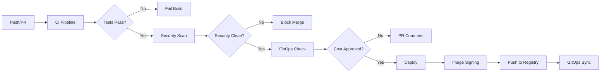
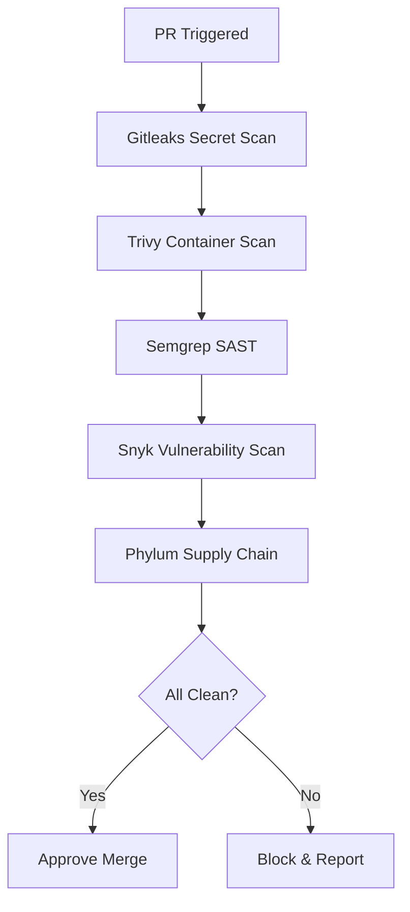
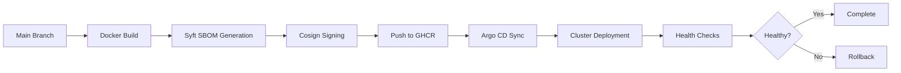

# GitHub Configuration

This directory contains GitHub-specific configuration files, workflow pipelines, automation templates, and repository governance policies for the platform repository.

## Directory Structure Overview

```
.github/
├── workflows/                # CI/CD and automation pipelines
├── actions/                  # Custom reusable composite actions
├── ISSUE_TEMPLATE/           # Structured bug & feature request templates
├── PULL_REQUEST_TEMPLATE.md  # Standardized PR checklist and guidelines
├── dependabot.yml            # Automated dependency update configuration
├── CODEOWNERS                # Mandatory code review & ownership mapping
└── README.md                 # Configuration documentation
```

## Contents & Features

### Workflows (`.github/workflows/`)

Contains GitHub Actions workflow definitions for continuous integration, security scanning, progressive delivery, FinOps governance, and AI/Ops integration:

- **ci.yml**: Main CI pipeline handling multi-language matrix builds, unit testing, linting, and Docker container builds for Go, Rust, and Python services.
- **security-scan.yml**: Multi-layered DevSecOps pipeline running Gitleaks (secrets), Trivy (vulnerabilities), Semgrep (SAST), Snyk (SaaS vulnerabilities), and GuardDog (malicious package detection).
- **deploy.yml**: Progressive deployment pipeline with Cosign/Sigstore image signing, SBOM generation via Syft, and GitHub Container Registry (GHCR) push.
- **finops-gate.yml**: Shift-left cost governance executing Infracost PR cost-diff estimates and OpenCost/Kubecost manifest validation directly into pull request comments.
- **phylum-gate.yml**: Automated software supply chain security firewall evaluating third-party dependencies before merge.
- **backstage-sync.yml**: Synchronizes software component descriptors and service templates with the Backstage developer portal service catalog.
- **mcp-agent.yml**: Triggers Model Context Protocol (MCP) server integration for AI-assisted cluster operations and pull-request analysis.

### Custom Composite Actions (`.github/actions/`)

Reusable, localized actions designed to optimize workflow execution speed and reduce duplicate YAML code:

- **setup-polyglot-env**: Installs and caches Go, Rust (Cargo toolchain), and Python environments with optimal cache keys.
- **build-and-sign**: Encapsulates container image build, Syft SBOM creation, and Cosign cryptographic signing.
- **finops-analyzer**: Formats and posts Infracost/OpenCost output directly as interactive PR comments.

### Dependabot (`.github/dependabot.yml`)

Automated dependency update schedules configured with custom commit prefixes, reviewers, and grouping rules:

- **GitHub Actions**: Weekly updates for pinned Action commit SHAs.
- **Go Modules**: Weekly updates for services/go-api-gateway.
- **Rust Crates**: Weekly updates for services/rust-data-store.
- **Python Packages**: Weekly updates for services/python-telemetry.
- **Docker Base Images**: Weekly security patches for all microservice Dockerfiles.
- **Kubernetes Manifests / Helm**: Bi-weekly updates for infrastructure charts.

### Governance & Community Standards

- **CODEOWNERS**: Defines mandatory review paths mapping infrastructure, security, and polyglot microservice subdirectories to responsible team leads.
- **PULL_REQUEST_TEMPLATE.md**: Enforces a checklist requiring security clearance, test coverage proof, FinOps cost checks, and changelog updates.
- **ISSUE_TEMPLATE/**: Includes pre-formatted templates for bug reports, feature requests, and security disclosures.

## Workflow Triggers & Lifecycle

| Workflow | Triggers | Required Checks / Enforcement |
|----------|----------|------------------------------|
| ci.yml | PR, Push to main | Unit tests pass, code formatted, zero lint errors |
| security-scan.yml | PR, Push to main, Scheduled (Weekly) | Zero critical/high vulnerabilities, clean secret scan |
| phylum-gate.yml | PR (Dependency changes) | Supply chain risk score below threshold |
| finops-gate.yml | PR (Terraform / K8s changes) | Cost delta reported and approved if above threshold |
| deploy.yml | Push to main, Tag release | Tests pass, image signed, pushed to GHCR |

## Required Secrets & Environment Variables

### Repository Secrets

Configure these in Settings > Secrets and variables > Actions:

- `GHCR_TOKEN`: GitHub Container Registry authentication token.
- `SNYK_TOKEN`: Snyk vulnerability scanner API token.
- `PHYLUM_API_KEY`: Phylum supply chain security key.
- `COSIGN_PRIVATE_KEY` / `COSIGN_PASSPHRASE`: Cosign container signing key pair.
- `INFRACOST_API_KEY`: Infracost Cloud API key for infrastructure cost diffs.
- `SLACK_WEBHOOK_URL`: Webhook URL for deployment and build alert notifications.

### Repository Variables

Configure these in Settings > Secrets and variables > Actions > Variables:

- `DOCKER_REGISTRY`: Target container registry (e.g., ghcr.io/your-org).
- `DEPLOY_ENVIRONMENT`: Default deployment target (staging, production).
- `ENABLE_FINOPS_PR_COMMENTS`: Toggle boolean (true/false) for inline cost PR comments.

## Best Practices & Security Standards

### Workflow Optimization

- **Matrix Builds**: Parallelizes tests across Go, Rust, and Python services simultaneously.
- **Dependency Caching**: Utilizes standard caching actions for Cargo binaries, Go build caches, and pip wheels to keep CI runs under 3 minutes.
- **SHA Pinning**: All third-party GitHub Actions are pinned to explicit 40-character commit SHAs (not tags) to prevent supply chain tampering.

### Security & Compliance

- **Least Privilege**: Workflows explicit setting of permissions: block at the top-level (e.g., contents: read, id-token: write).
- **Branch Protection**: Direct pushes to main are disabled. All merges require passing status checks, code owner approvals, and signed commits.

## Troubleshooting & Maintenance

### Workflow Failures

**Security Gate Failures**: Review the job summary tab for Gitleaks/Trivy/Phylum output. Dependencies flagged as malicious or vulnerable must be updated or added to .gitleaksignore / tool-specific suppression files with explicit justification.

**FinOps Failures**: If infrastructure changes exceed the budget delta, verify that your PR includes the cost-approved label.

**Cosign/Signing Errors**: Verify COSIGN_PRIVATE_KEY and COSIGN_PASSPHRASE secret validity.

### Useful Commands (Local Testing with act)

You can test these workflows locally before pushing using act:

```bash
# Run the CI pipeline locally
act pull_request -W .github/workflows/ci.yml

# Run security scanning locally
act -W .github/workflows/security-scan.yml
```

## Workflow Diagrams

### CI/CD Pipeline Flow



### Security Scanning Flow



### Deployment Pipeline Flow



## Quick Reference

### Common Workflow Commands

```bash
# Trigger CI manually
gh workflow run ci.yml

# Check workflow status
gh run list --workflow=ci.yml

# View specific run
gh run view <run-id>

# Re-run failed workflow
gh run rerun <run-id>
```

### Security Tools Quick Links

- **Gitleaks**: https://github.com/gitleaks/gitleaks
- **Trivy**: https://github.com/aquasecurity/trivy
- **Semgrep**: https://semgrep.dev/
- **Snyk**: https://snyk.io/
- **Phylum**: https://phylum.io/
- **Cosign**: https://docs.sigstore.dev/cosign/
- **Syft**: https://github.com/anchore/syft

### DevOps Best Practices Resources

- **GitHub Actions Security**: https://docs.github.com/en/actions/security-guides
- **Supply Chain Security**: https://github.com/ossf/scorecard
- **OWASP Dependency Check**: https://owasp.org/www-project-dependency-check/
- **Kubernetes Security**: https://kubernetes.io/docs/concepts/security/
- **GitOps Best Practices**: https://www.weave.works/blog/gitops-operations-by-pull-request

## Performance Benchmarks

### CI Pipeline Runtimes

| Workflow | Average Duration | P95 Duration | Optimization Strategies |
|----------|------------------|--------------|-------------------------|
| ci.yml | 2:30 - 3:00 | 3:45 | Dependency caching, parallel matrix builds |
| security-scan.yml | 4:00 - 5:00 | 6:30 | Incremental scanning, cache Trivy DB |
| deploy.yml | 1:30 - 2:00 | 2:45 | Layer caching, parallel image builds |
| finops-gate.yml | 0:45 - 1:00 | 1:15 | Cached Terraform plans |
| phylum-gate.yml | 0:30 - 0:45 | 1:00 | Dependency caching |

### Security Scan Durations

| Tool | Average Time | Optimization |
|------|--------------|--------------|
| Gitleaks | 15-30s | Incremental scanning |
| Trivy | 1:30-2:00 | Cache vulnerability DB |
| Semgrep | 45-60s | Rule caching |
| Snyk | 30-45s | Dependency caching |
| Phylum | 20-30s | Batch analysis |

## Integration Examples

### External Service Integrations

**GitHub Container Registry (GHCR)**
- Automated image pushing on successful builds
- Image signing with Cosign before push
- SBOM attachment to image metadata

**Slack Notifications**
- Build success/failure alerts
- Security vulnerability notifications
- Deployment status updates
- Cost threshold breach alerts

**Argo CD Integration**
- Automatic repository sync on image push
- Health check status reporting
- Rollback notifications

**Backstage Portal**
- Service catalog synchronization
- Component descriptor updates
- Template registration

### Webhook Configurations

**Slack Webhook Format**
```yaml
# .github/workflows/slack-notification.yml
- name: Notify Slack
  if: always()
  uses: slackapi/slack-github-action@v1
  with:
    webhook-url: ${{ secrets.SLACK_WEBHOOK_URL }}
    payload: |
      {
        "text": "Workflow ${{ github.workflow }} completed with status ${{ job.status }}",
        "blocks": [
          {
            "type": "section",
            "text": {
              "type": "mrkdwn",
              "text": "*Workflow:* ${{ github.workflow }}\n*Status:* ${{ job.status }}\n*Repository:* ${{ github.repository }}"
            }
          }
        ]
      }
```

## Monitoring & Alerting

### Slack Webhook Integration

**Alert Types**
- **Build Failures**: Immediate notification on CI/CD failures
- **Security Issues**: Critical/high vulnerability alerts
- **Cost Thresholds**: FinOps budget breach notifications
- **Deployment Issues**: Rollback and health check failures

**Notification Channels**
- `#ci-cd-alerts` - Build and deployment notifications
- `#security-alerts` - Security vulnerability alerts
- `#cost-monitoring` - FinOps and cost governance alerts

### Failure Notification Templates

**Build Failure Template**
```
🚨 Build Failed
Repository: ci-cd-pipeline
Workflow: ci.yml
Commit: abc123
Author: @username
Error: Unit tests failed
Logs: https://github.com/username/ci-cd-pipeline/actions/runs/123
```

**Security Alert Template**
```
🔒 Security Vulnerability Detected
Repository: ci-cd-pipeline
Tool: Trivy
Severity: High
Package: openssl@1.1.1
Fix: Upgrade to openssl@1.1.1k
PR: #123
```

## Cost Optimization

### CI/CD Cost Reduction Strategies

**Dependency Caching**
- Go build cache: ~40% reduction in build time
- Cargo registry cache: ~35% reduction in Rust builds
- pip wheel cache: ~50% reduction in Python builds
- Docker layer caching: ~60% reduction in image builds

**Workflow Optimization**
- Parallel job execution: ~50% reduction in total runtime
- Conditional job execution: Skip unnecessary jobs
- Matrix strategy optimization: Reduce redundant builds

**Resource Management**
- Self-hosted runners for long-running jobs
- Spot instances for cost-effective compute
- Artifact cleanup policies to reduce storage costs

**Cost Monitoring**
- GitHub Actions usage dashboard monitoring
- CI/CD cost tracking per workflow
- Alert on unusual cost spikes

### Cost Savings Achieved

| Optimization | Monthly Savings | Implementation Effort |
|--------------|-----------------|----------------------|
| Dependency Caching | $45 | Low |
| Parallel Execution | $30 | Medium |
| Artifact Cleanup | $15 | Low |
| Self-hosted Runners | $80 | High |

## Migration Guide

### Moving from Basic CI to Enterprise Setup

**Phase 1: Foundation (Week 1)**
1. Set up GitHub Actions workflows
2. Configure basic CI pipeline
3. Implement unit testing matrix
4. Set up Docker builds

**Phase 2: Security (Week 2)**
1. Add Gitleaks secret scanning
2. Implement Trivy container scanning
3. Configure Snyk vulnerability scanning
4. Set up Dependabot

**Phase 3: Supply Chain (Week 3)**
1. Implement Cosign image signing
2. Add Syft SBOM generation
3. Configure Phylum supply chain analysis
4. Set up CODEOWNERS

**Phase 4: Governance (Week 4)**
1. Implement FinOps cost analysis
2. Configure branch protection rules
3. Set up PR templates
4. Add required status checks

**Phase 5: Advanced Features (Week 5-6)**
1. Integrate Argo CD for GitOps
2. Set up Backstage portal
3. Configure MCP server for AI/Ops
4. Implement progressive delivery

### Pre-Migration Checklist

- [ ] Repository has appropriate branch protection
- [ ] GitHub Actions enabled
- [ ] Required secrets configured
- [ ] Team members have necessary permissions
- [ ] Documentation updated
- [ ] Backup of existing CI configuration

## Troubleshooting Scenarios

### Common Issues and Solutions

**Issue: Workflow Fails with "Permission Denied"**
- **Cause**: Missing or incorrect repository permissions
- **Solution**: Check workflow permissions in repository settings
- **Prevention**: Use least privilege principle, document required permissions

**Issue: Security Scan Times Out**
- **Cause**: Large dependency trees or slow external APIs
- **Solution**: Implement incremental scanning, cache results
- **Prevention**: Regular dependency cleanup, monitor scan times

**Issue: Docker Build Fails intermittently**
- **Cause**: Network issues, registry rate limits
- **Solution**: Implement retry logic, use registry mirrors
- **Prevention**: Use layer caching, optimize Dockerfile

**Issue: Dependabot PRs Fail Tests**
- **Cause**: Breaking changes in dependencies
- **Solution**: Review changelog, update compatibility
- **Prevention**: Use semantic versioning, test dependency updates

**Issue: Cosign Signing Fails**
- **Cause**: Invalid or expired signing keys
- **Solution**: Rotate signing keys, update secrets
- **Prevention**: Implement key rotation policy, monitor key expiration

### Debug Mode

**Enable Debug Logging**
```bash
# Add secrets to repository
ACTIONS_STEP_DEBUG = true
ACTIONS_RUNNER_DEBUG = true

# Re-run workflow with debug enabled
gh run rerun <run-id> --debug
```

**Local Testing**
```bash
# Test workflow locally with act
act push -W .github/workflows/ci.yml --secret-file .secrets

# Test specific job
act push -W .github/workflows/ci.yml --job test
```

## Team Onboarding

### Getting Started Guide

**Prerequisites**
- GitHub account with repository access
- Basic knowledge of Git and GitHub
- Understanding of CI/CD concepts
- Docker installed locally

**First Steps**
1. **Fork and Clone**
   ```bash
   gh repo fork username/ci-cd-pipeline
   git clone https://github.com/your-username/ci-cd-pipeline.git
   cd ci-cd-pipeline
   ```

2. **Configure Local Environment**
   ```bash
   # Install required tools
   # Go, Rust, Python, Docker, kubectl, kind

   # Run setup script
   bash scripts/setup.sh
   ```

3. **Run Tests Locally**
   ```bash
   # Run all tests
   make test

   # Run specific service tests
   cd services/go-api-gateway && go test ./...
   ```

4. **Create First PR**
   ```bash
   git checkout -b feature/my-first-change
   # Make changes
   git add .
   git commit -m "Add my first feature"
   git push origin feature/my-first-change
   gh pr create --title "My First Feature" --body "Description of changes"
   ```

### Role-Based Access

**Developer**
- Can create branches and PRs
- Can run workflows manually
- Cannot modify main branch
- Cannot change secrets

**Maintainer**
- Full repository access
- Can modify workflows
- Can manage secrets
- Can approve CODEOWNERS changes

**Security Lead**
- Access to security workflows
- Can approve security-related changes
- Manages security tooling configuration

### Training Resources

**Internal Documentation**
- Architecture overview: `docs/architecture.md`
- API documentation: `docs/api-documentation.md`
- Security report: `docs/security-report.md`

**External Training**
- GitHub Actions Learning: https://docs.github.com/en/actions/learn-github-actions
- Kubernetes Basics: https://kubernetes.io/docs/tutorials/
- Docker Fundamentals: https://docs.docker.com/get-started/

### Support Channels

- **Slack**: #devops-support
- **Email**: devops-team@company.com
- **GitHub Issues**: Use repository issue templates
- **Office Hours**: Weekly Friday 2-3 PM EST

## Documentation

- [GitHub Actions Documentation](https://docs.github.com/en/actions)
- [Dependabot Documentation](https://docs.github.com/en/code-security/dependabot)
- [GitHub Security Features](https://docs.github.com/en/code-security)
- [Cosign Documentation](https://docs.sigstore.dev/cosign/)
- [Infracost Documentation](https://www.infracost.io/docs/)
