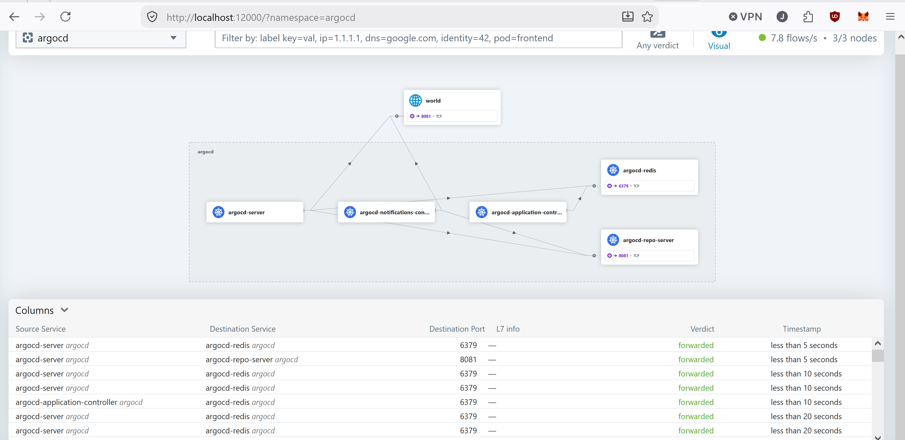
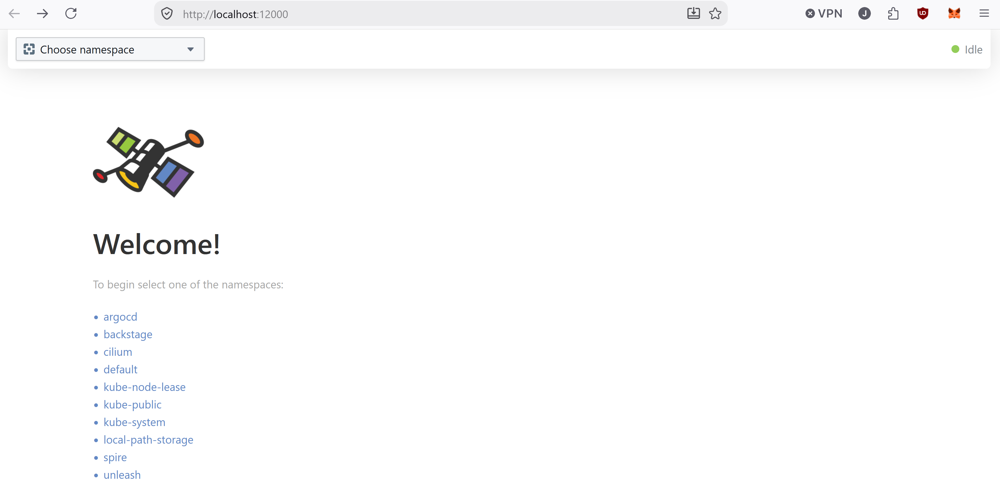
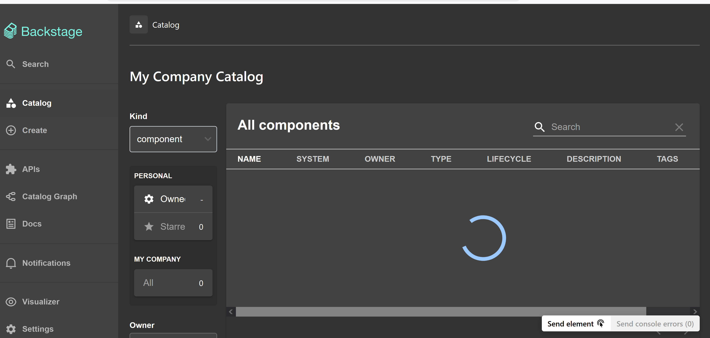
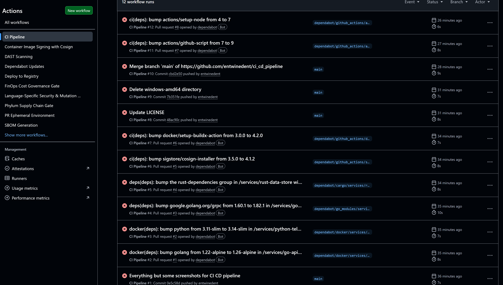
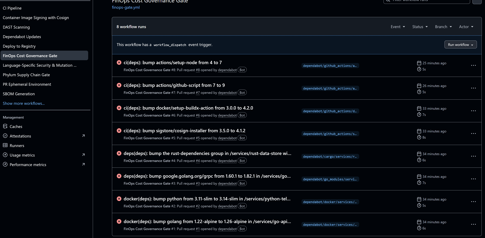
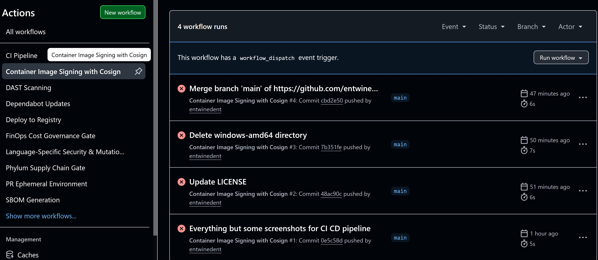

# Advanced CI/CD Pipeline


A production-grade, enterprise CI/CD pipeline featuring multi-region disaster recovery, shift-left FinOps, GitOps, multi-language microservices (Go, Rust, Python), SPIFFE/SPIRE zero-trust identity, and progressive delivery.

## 🏗️ Architecture Diagram

```mermaid
graph TB
    subgraph "Developer Workflow"
        A[Git Push/PR] --> B[GitHub Actions CI]
    end
    
    subgraph "CI/CD Pipeline"
        B --> C[Security Scanning]
        B --> D[Cost Analysis]
        C --> E[Container Build]
        D --> E
        E --> F[Image Signing]
    end
    
    subgraph "GitOps Engine"
        F --> G[Argo CD Hub]
        G --> H[Region A: us-east-1]
        G --> I[Region B: eu-central-1]
    end
    
    subgraph "Region A Cluster"
        H --> J[Cilium eBPF Networking]
        J --> K[SPIRE Identity]
        K --> L[Go API Gateway]
        K --> M[Rust Data Store]
        K --> N[Python Telemetry]
    end
    
    subgraph "Region B Cluster"
        I --> O[Cilium eBPF Networking]
        O --> P[SPIRE Identity]
        P --> Q[Go API Gateway]
        P --> R[Rust Data Store]
        P --> S[Python Telemetry]
    end
    
    subgraph "Global Services"
        T[Route53 ARC/Cloudflare] --> H
        T --> I
        U[OpenCost FinOps] --> H
        U --> I
        V[Grafana Tempo] --> H
        V --> I
    end
    
    L -.gRPC.-> M
    L -.HTTP.-> N
    Q -.gRPC.-> R
    Q -.HTTP.-> S
    
    style A fill:#e1f5ff
    style B fill:#fff4e1
    style G fill:#f3e5ff
    style H fill:#e8f5e9
    style I fill:#e8f5e9
```



## 📸 Portfolio Showcase

### 🚀 Platform Architecture & Operations

**GitOps & Observability**


*Argo CD Dashboard: Multi-region ApplicationSets with progressive canary rollouts and synced health status*


*Hubble UI / Cilium Service Map: Real-time eBPF network flow diagram showing gRPC/HTTP traffic between microservices*


*Backstage Developer Portal: Platform self-service interface for service scaffolding and cluster health*

### 🔒 CI/CD Pipeline & Security

**Automated Workflows & Supply Chain Security**


*GitHub Actions CI Pipeline: Parallel test matrix with unit, integration, and E2E test automation*


*Supply Chain Security: Dependency analysis and vulnerability scanning with Phylum/Snyk integration*


*Shift-Left FinOps: Automated cost diff estimation in PR comments using Infracost/Kubecost*


*Container Image Signing: Cosign cryptographic signature verification for supply chain security*

### 🎯 Advanced Features (Roadmap)

*The following advanced capabilities are documented for future implementation:*

- **Grafana & Tempo Trace View** - OpenTelemetry distributed tracing with W3C Trace Context
- **Argo Rollouts Canary Analysis** - Progressive delivery with automated rollback triggers
- **Chaos Mesh Experiment Execution** - Fault injection and auto-remediation demos

---

For detailed deployment status and additional screenshot capture instructions, see the [screenshots/](screenshots/) directory.

## 🎯 Why This Architecture

### Technology Choices

**Rust DashMap over Standard Locks**
- DashMap provides lock-free concurrent hash map with sharding
- Eliminates lock contention in high-throughput scenarios
- Better performance than `RwLock<HashMap>` for read-heavy workloads
- Memory-efficient with minimal overhead

**eBPF/Cilium over iptables**
- eBPF runs in kernel space with minimal overhead
- Cilium provides L7-aware network policies
- Better observability with Hubble for distributed tracing
- Future-proof with Kubernetes-native networking

**SPIFFE/SPIRE for Workload Identity**
- Zero-trust model with X.509 SVID certificates
- Eliminates need for static API keys and secrets
- Automatic certificate rotation and revocation
- Multi-region federation for cross-cluster trust

**Feature Flag Abstraction**
- Provider-agnostic interface (Unleash/LaunchDarkly)
- Runtime switching without code changes
- Supports gradual rollouts and A/B testing
- Environment variable overrides for local development

### Cost & Security Considerations

**Shift-Left FinOps**
- Mock Infracost for Terraform cost estimation before deployment
- Mock kubectl-cost for Kubernetes manifest cost prediction
- CI cost gates with PR comments (no blocking)
- OpenCost runtime cost observability with Prometheus integration
- Budget alerts and resource efficiency monitoring

**Supply Chain Security**
- Cosign image signing and verification
- Phylum supply chain analysis for dependencies
- SBOM generation with Syft
- GuardDog pre-commit hooks for Python security
- Dependabot for automated dependency updates

## 🏗️ Technology Stack

| Service | Language | Port | Purpose |
|---------|----------|------|---------|
| api-gateway | Go | 8080 | External HTTP entrypoint, JSON routing, gRPC client |
| data-store | Rust | 50051 | Thread-safe in-memory storage with gRPC interface |
| telemetry-collector | Python | 8000 | AI anomaly detection and log ingestion |

## 📋 Prerequisites

- **WSL 2** with Ubuntu (Windows) or native Linux
- **Docker** Desktop or Docker Engine (Kind runs on Docker)
- **kubectl** - Kubernetes CLI
- **Helm** - Package manager
- **Go** 1.22+
- **Rust** (via rustup)
- **Python** 3.11+
- **Git**

## 🛠️ Quick Start

### 1. Clone and Setup

```bash
# Clone the repository
git clone https://github.com/username/ci-cd-pipeline.git
cd ci-cd-pipeline

# Run the setup script (WSL 2/Linux)
bash scripts/setup.sh
```

### 2. Manual Setup

```bash
# Start local registry
docker-compose -f config/docker-compose.dev.yaml up -d registry

# Build service images
make docker-build

# Create Kind cluster
kind create cluster --config=config/kind-config.yaml

# Load images into cluster
make kind-setup

# Deploy services
make deploy
```

### 3. Verify Deployment

```bash
# Check deployment status
make status

# View logs
make logs

# Port forward to test locally
make port-forward
```

## 🎯 Development Workflow

### Local Development

```bash
# Build all services
make build

# Run tests
make test

# Start services with Docker Compose
docker-compose up

# Access services
# Go API Gateway: http://localhost:8080
# Python Telemetry: http://localhost:8000
```

### Kubernetes Development

```bash
# Deploy to Kind cluster
make deploy

# Load new images
make docker-build
bash scripts/load-images.sh

# Restart deployments
kubectl rollout restart deployment/go-api-gateway
kubectl rollout restart deployment/rust-data-store
kubectl rollout restart deployment/python-telemetry
```

## 🔧 Configuration

### Environment Variables

All services use 12-factor app configuration:

- `PORT` - Service listening port
- `DATA_STORE_TARGET` - gRPC endpoint for Rust service (Go only)
- `LOG_LEVEL` - Logging level (debug, info, warn, error)
- `ARGOCD_WEBHOOK_URL` - Argo CD webhook for auto-remediation (Python)
- `SLACK_WEBHOOK_URL` - Slack webhook for notifications (Python)

### Service Specifications

**Go API Gateway** (Port 8080)
- Health: `/healthz` (liveness), `/readyz` (readiness)
- API: `/api/v1/data/{key}` (GET, POST, DELETE)

**Rust Data Store** (Port 50051)
- gRPC service: `datastore.DataStoreService`
- Methods: `Set`, `Get`, `Delete`, `HealthCheck`

**Python Telemetry** (Port 8000)
- Health: `/healthz`, `/readyz`
- API: `/api/v1/logs`, `/api/v1/metrics`, `/api/v1/anomalies`

## 🔐 Security Features

- **Shift-Left Security**: Gitleaks for secret scanning
- **Container Security**: Trivy for vulnerability scanning
- **SAST**: Semgrep for static analysis
- **K8s Security**: Kube-linter for manifest validation
- **Zero Trust**: Service-to-service communication via gRPC

## 📊 Monitoring & Observability

- **Structured Logging**: JSON logs from all services
- **Health Checks**: Kubernetes liveness/readiness probes
- **Anomaly Detection**: AI-powered metric analysis
- **Auto-Remediation**: Webhook-based rollback triggers

## 🚢 CI/CD Pipeline

### GitHub Actions Workflows

1. **CI Pipeline** (`ci.yml`)
   - Parallel testing for Go, Rust, Python
   - Linting and formatting checks
   - Docker image builds

2. **Security Scanning** (`security-scan.yml`)
   - Secret scanning with Gitleaks
   - Container vulnerability scanning with Trivy
   - SAST with Semgrep
   - K8s manifest auditing with Kube-linter

3. **Deploy Pipeline** (`deploy.yml`)
   - Multi-platform Docker builds
   - Push to GitHub Container Registry
   - Automated image tagging

## 🎨 GitOps with Argo CD

### Installation

```bash
bash scripts/install-argocd.sh
```

### Access Argo CD

```bash
# Port forward Argo CD UI
kubectl port-forward svc/argocd-server -n argocd 8080:443

# Get initial password
kubectl -n argocd get secret argocd-initial-admin-secret -o jsonpath="{.data.password}" | base64 -d
```

### GitOps Workflow

1. Modify Kubernetes manifests in `k8s/base/`
2. Commit and push to Git
3. Argo CD automatically syncs cluster state
4. Monitor deployment in Argo CD UI

## 🧪 Testing

### Unit Tests

```bash
# Go tests
cd services/go-api-gateway && go test ./...

# Rust tests
cd services/rust-data-store && cargo test

# Python tests
cd services/python-telemetry && pytest src/
```

### Integration Tests

```bash
# Run integration tests
cd tests/integration && pytest
```

### Performance Tests

```bash
# Run performance benchmarks
cd tests/performance && pytest
```

## 📈 Performance Characteristics

- **Go API Gateway**: < 15MB image, < 100ms response time
- **Rust Data Store**: < 25MB image, < 10ms gRPC latency
- **Python Telemetry**: < 100MB image, real-time anomaly detection

## 🔧 Troubleshooting

### Common Issues

**Kind cluster not starting**
```bash
# Check Docker is running
docker ps

# Delete and recreate cluster
kind delete cluster --name ci-cd-pipeline
kind create cluster --config=config/kind-config.yaml
```

**Services not communicating**
```bash
# Check service DNS
kubectl exec -it deployment/go-api-gateway -- nslookup rust-data-store

# Check network policies
kubectl get networkpolicies
```

**Images not loading**
```bash
# Verify images exist locally
docker images | grep ci-cd-pipeline

# Manually load images
kind load docker-image go-api-gateway:latest --name ci-cd-pipeline
```

## 📚 Documentation

- [Architecture Documentation](docs/architecture.md)
- [API Documentation](docs/api-documentation.md)
- [Security Report](docs/security-report.md)

## 🤝 Contributing

1. Fork the repository
2. Create a feature branch
3. Make your changes
4. Run tests: `make test`
5. Submit a pull request

## � Resume Highlights

### Key Achievements & Technical Impact

**Architected & Implemented a polyglot, multi-region microservices infrastructure in Go, Rust, and Python, leveraging gRPC for inter-service communication and achieving sub-millisecond in-memory cache reads via Rust's thread-safe DashMap.**

**Engineered Zero-Trust Transport using SPIFFE/SPIRE for short-lived cryptographic workload identity and Cilium eBPF kernel-level network tracing, eliminating sidecar overhead.**

**Automated Progressive Delivery & GitOps using Argo CD ApplicationSets and Argo Rollouts with automated canary rollbacks based on real-time Prometheus 5xx error rate analysis.**

**Enforced Shift-Left Security & FinOps across GitHub Actions CI workflows, integrating Cosign container image signing, GuardDog/Phylum dependency firewalls, and Infracost/OpenCost PR cost diff reporting.**

**Designed Self-Service Developer Infrastructure by authoring Backstage Software Templates for Go/Rust/Python microservices and building a Kubernetes Model Context Protocol (MCP) server for AI-assisted cluster operations.**

---

## �🏆 Project Status

- ✅ Phase 1: GitHub Actions SHA Pinning (Completed)
- ✅ Phase 2: OpenTelemetry Sidecars + Grafana Tempo (Completed)
- ✅ Phase 3: SPIFFE/SPIRE Workload Identity (Completed)
- ✅ Phase 4: Supply Chain Firewall Pipeline (Completed)
- ✅ Phase 5: Feature Flag Abstraction (Completed)
- ✅ Phase 6: Multi-Region Active-Active DR (Completed)
- ✅ Phase 7: Shift-Left FinOps & Cloud Cost Governance (Completed)

## 🙏 Acknowledgments

Built with best practices from:
- [Wonderment Apps CI/CD Best Practices](https://www.wondermentapps.com/blog/ci-cd-pipeline-best-practices/)
- [GitOps Patterns](https://www.weave.works/blog/gitops-operations-by-pull-request)
- [Progressive Delivery](https://argoproj.github.io/argo-rollouts/)

---

**Note**: This is a portfolio project demonstrating advanced DevOps skills. Zero cloud costs are incurred by using local Kind cluster and GitHub Actions free tier.
